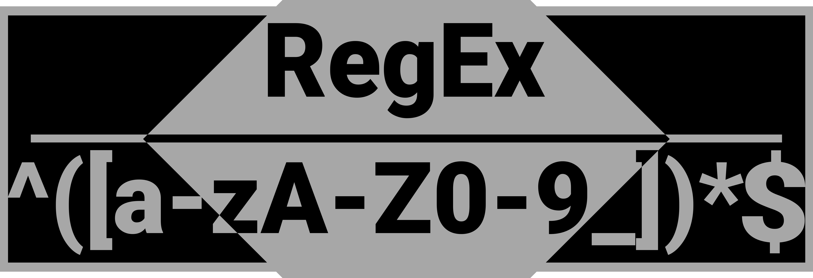

# Introduction

This project aims to make a small library to build and exploit classical Regex.
The code is made in order to allow developper to add of new features as easy as possible
by being construct in oriented object and using classical design pattern (like composite,visitor and state).
Regex built in this library may not be as optimized as the ones provided by the standard library, but like I said previously, this library was first made to be pedagogical and to allow to add extensions to regex language.

# Features

This library allows to use basic regex syntax :

 - Recognize text
 - Using set format like [a-zA-z_]
 - Quantifiers
	- \* Zero or more
	- ? Zero or one
	- \+ One or more
	- a{0,5}
	- Lazy quantifier using '?' after any others quantifiers
- Special character :
	- . everything except \n and \r
	- \t \n \r
	- \b \B for word and non word
	- \d \D for number and non number
	- \w \W for whitespace and non whitespace

- Anchor :
	- ^ $ : begin and end of string
	- \b \B word boundaries and non word boundaries
- Group :
	- Capture group using ('sub regex')
	- Non capturing group using (?:'sub regex')
	- LookAhead group using (?='sub regex')
	- Negative lookahead using (?!'sub regex')
- Logical Or : '|'
- Regex Flags :
	- STICKY : Allow to set the position of start of the Regex
	- CASE_INSENSITIVE : The regex will be case insensitive
	- GLOBAL_SEARCH : The regex will loop through all character of the string to parse.
	- MULTILINE : Begin and end of string match '\n' in addition of classical beginning and end of string.

# Usage

## Getting started

In order to build and try to match a regex, please refer to the following steps :

1. Import the header
```C++
#include "Regex.h"
```
2. Create your regex with your pattern
3. Match your regex with a string
4. Exploit the matches

```C++
	//Build the regex with a pattern to extract word
	//Here is an example with a pattern matching any word beginning with 'w'
	Regex temp("\\b.+?\\b");
	//Create a string to match
	std::string test("wall wire whole");
	//Try to match the pattern with the string
	Match matchs = temp.matchString(test);
	//Print the matches
	std::cout << matchs.getPrint() << std::endl;
	int counter = countMatch(&matchs);
	std::cout << "Number of matches : " << counter << std::endl;
```

If you want to get a string representing the match, use the getPrint() method.

## Manipulation

### Iterate through matches

In order to iterate through a match, follow this example which build a function to count the number of matches countain in the result of a regex.
```C++
int countMatch(Match* matchs)
{
	//Initialize the counter
	int counter = 0;
	//We don't count the first match because it's the root of all matches.
	//Count all the sub match
	for (Match *m : matchs->getChild())
	{
		counter+= countMatch(m);
		counter++;
	}
	return counter;
}
```

### Manipulate a Regex

Regex has 4 options(See the features section for more informations) that can applied when creating them, in order to do use them, refer to this example :
```C++
	//Create a regex matching hello world ! without paying attention to the case of the character.
	Regex temp("Hello World !",GLOBAL_SEARCH|CASE_INSENSITIVE);
	//Create a string to match
	std::string test("HeLLo World !\nHello WORLd !");
	//Try to match the pattern with the string
	Match matchs = temp.matchString(test);
	//Print the matches
	std::cout << matchs.getPrint() << std::endl;
```
This example will produces 2 matches.

In this example, the regex pass all over the string to test by using the ``GLOBAL_SEARCH`` flag. By default the regex will stop at the first match it find and so, il will always output the same match if the test is launch again.
To avoid the regex to always stick at the begining of the string to analyse but without analysing all the string, use the ``STICKY`` flag.
Here is an example :
```C++
	Regex temp("Hello World !",STICKY|CASE_INSENSITIVE);
	//Create a string to match
	std::string test("HeLLo World !\nHello WORLd !");
	//First match a the beginning of the string
	Match matchs = temp.matchString(test);
	std::cout <<"First match : "<< matchs.getPrint() << std::endl;
	//Move the regex to his last position in order to continue the parsing.
	matchs = temp.SetPos(temp.getLastPos()).matchString(test);
	//Print the result
	std::cout << "Second match : "<< matchs.getPrint() << std::endl;
```

# ToDos

- [x] character support
- [x] Quantifier support
- [x] Set support
- [x] Special character support
- [x] Anchor support
- [x] Class for managing match and sub-match
- [x] Separate Engine in two class, one for building regex, and one for containing them
- [x] Capturing group
- [x] Adding quantifiers  support for groups
- [x] Correcting Matchs depth bug
- [x] Adding Lazy quantifiers support for groups
- [x] Or '|'
- [x] Adding User quantifiers({a,b}) support
- [x] Flags managment
- [x] Non capturing group
- [x] Positive and negative lookahead
- [ ] Cleaning code
- [ ] Add better way to manage matches
- [ ] Add commentaries
- [ ] Add documentation about regex
- [ ] Add documentation about the organisation of the code

# Author

[```Cuadros Nicolas```](https://github.com/Inagaroth)